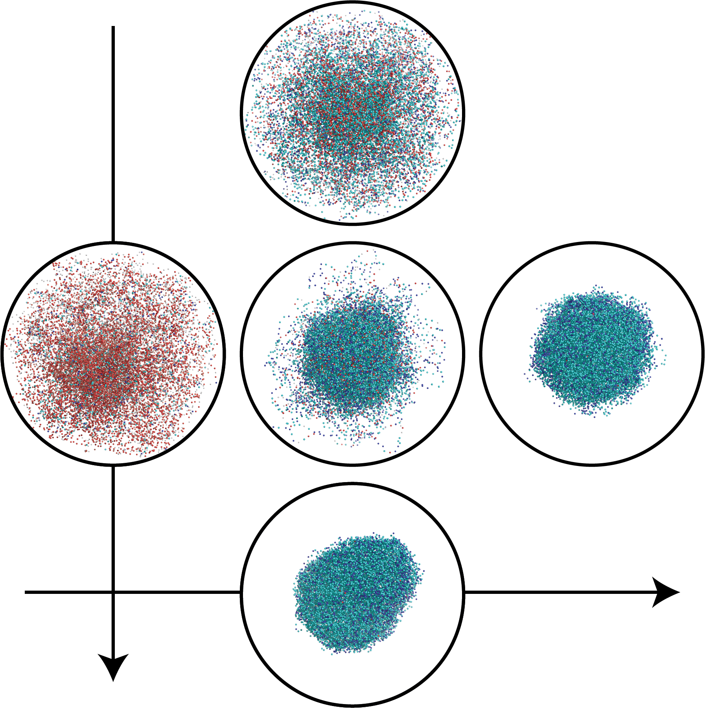

# Chromo: Physics-Based Chromatin Simulator

Joseph Wakim, Bruno Beltran, Andrew Spakowitz

## Quickstart

Chromo is publicly available on the Spakowitz Lab GitHub account in the
`“Chromo” repository <https://github.com/SpakowitzLab/chromo>`_.
The software is primarily designed for Unix-like environments (Mac and Linux)
using the Anaconda package manager.
Follow the steps below to set up Chromo locally:

1. Clone the Chromo repository to your local machine.

   `$ git clone https://github.com/SpakowitzLab/chromo.git`

2. Run :code:`make_all.sh` in the main directory of the repository to automatically
   set up a new conda environment named :code:`chromo`, install the required
   dependencies, and compile the Cython code.

   `$ cd chromo`

   `$ bash make_all.sh`

   `$ conda activate chromo`

## Introduction

As a successor to [WLCSIM](https://wlcsim.readthedocs.io/en/latest/),
Chromo is a **physics-based Monte Carlo (MC) simulator** developed
by the Spakowitz Lab at Stanford University to model the
**spatial organization of chromatin**.
The simulator is implemented in **Python and Cython**, enabling efficient
evaluation of MC steps.
The software is **lightweight**, with coarse-grained chromosome simulations
running on a single CPU core in under two days.
Chromo is implemented in an **object oriented manner** to promote future
adaption of the software.
This documentation provides descriptions of the **codebase** and
**associated theory**.
The documentation also includes **tutorials** to guide users through example
simulations.
We encourage use and modification of the simulator for research purposes to
model chromatin or other polymer systems.

Chromatin Simulation
--------------------

For the purposes of simulation chromatin, we begin with a pattern of epigenetic
marks that are derived from ChIP-seq data.
These epigenetic marks determine the identities of monomers along the chromatin
fiber.
Epigenetic marks are preferentially bound by reader proteins, which interact
with one-another to affect chromatin architecture.
Using Monte Carlo simulation, we obtain thermodynamically determined chromatin
configurations based on the cooperative binding of reader proteins to the
chromatin fiber.

    

Using our physics-based simulator, we can vary conditions in the nuclear
environment to study effects on chromatin organization.
For example, we can study the effects of reader protein concentrations and
interactions affect chromatin compartmentalization.

    

We also use the codebase in `Wakim and Spakowitz, PNAS, 2024 <https://www.pnas.org/doi/abs/10.1073/pnas.2317911121?af=R>`_
to resolve steric clashes between nucleosomes in chromatin fibers
modeled with the kinked wormlike chain.

    

Overall, Chromo provides an adaptable simulation framework for modeling
chromatin in a bottom-up manner, using principles of polymer physics and
statistical mechanics. The simulator captures the cooperative binding of
multiple reader proteins to their respective epigenetic marks. The tool can
be used to model chromatin at variable length scales and with varying levels
of detail.
